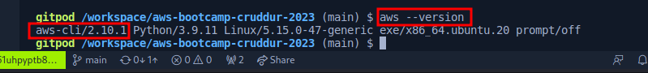
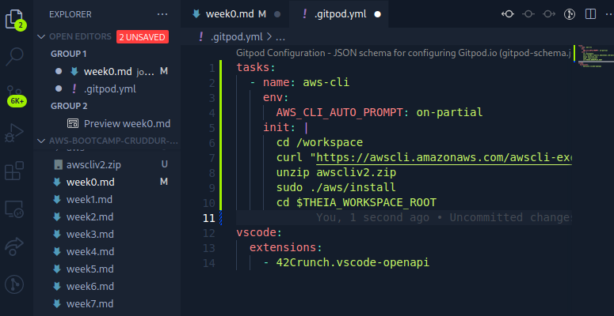
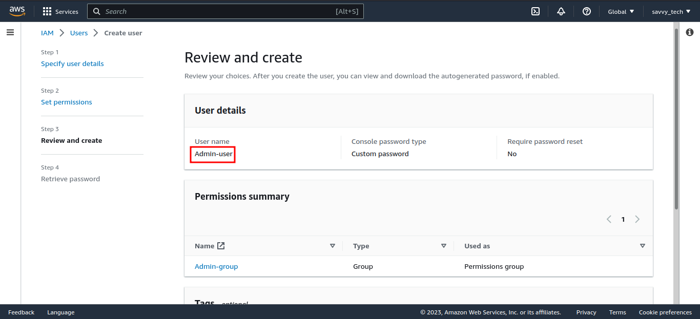
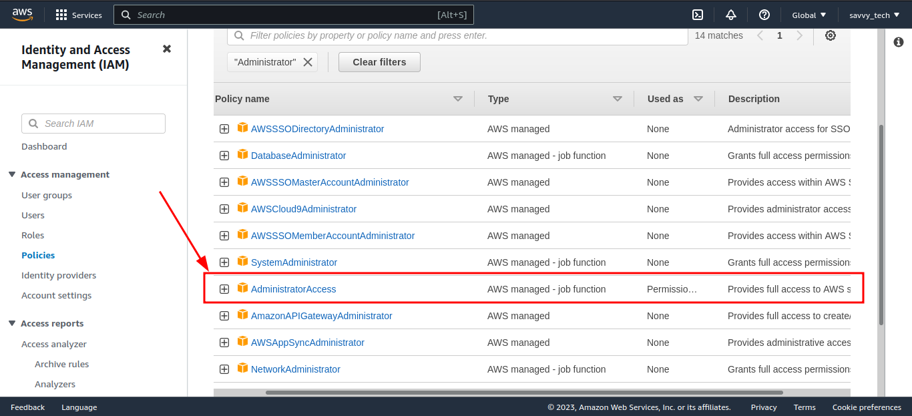
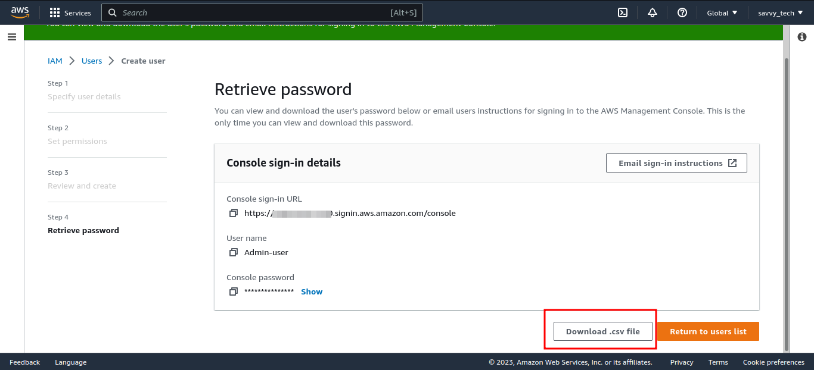
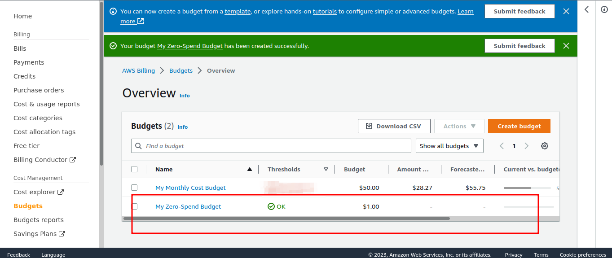

# Week 0 — Billing and Architecture
## Required Homework/Taksk
-------
### Install and Verify AWS CLI
*  Installed AWS CLI via Gitpod and verified the installation using the `aws --version` command 

* Setup AWS CLI to use partial auto prompt mode
* The bash commands we are using are the same as the instructions in this link [AWS CLI Install Instructions](https://docs.aws.amazon.com/cli/latest/userguide/getting-started-install.html)

### Updated .gitpod.yml to include the following text.

        tasks:
    - name: aws-cli
        env:
        AWS_CLI_AUTO_PROMPT: on-partial
        init: |
        cd /workspace
        curl "https://awscli.amazonaws.com/awscli-exe-linux-x86_64.zip" -o "awscliv2.zip"
        unzip awscliv2.zip
        sudo ./aws/install
        cd $THEIA_WORKSPACE_ROOT

### Create a new User and Generate AWS Credentials
* Go to [IAM Users Console](https://us-east-1.console.aws.amazon.com/iamv2/home?region=us-east-1#/users) 
* create a new user
* Enable console access for the user
* Create a new Admin Group and apply AdministratorAccess
* Create the user and go find and click into the user
* Created security credential for the user and downloaded the .csv file containing the credentials

  

  
 
  
  

* Setup Multi Factor Authentication (MFA) for the Admin-user (IAM user) because this is best practice for improved security.

* I Signed out of root user and signed in as the new IAM user

-----------

### Setting Up Environment Variable
I used the credentials to set up environment variables for the current bash terminal and persisted it afterwards.

    export AWS_ACCESS_KEY_ID=""
    export AWS_SECRET_ACCESS_KEY=""
    export AWS_DEFAULT_REGION=us-east-1

### Allowed Gitpod to use credentials next time I open my workspace

    gp env AWS_ACCESS_KEY_ID=""
    gp env AWS_SECRET_ACCESS_KEY=""
    gp env AWS_DEFAULT_REGION=us-east-1

### I verified that AWS CLI is working using the command below

  `aws sts get-caller-identity`

OR

  `aws sts get-caller-identity --query Account --output text`

### Created SNS Topic
`aws sns create-topic --name billing-alarm`
This returned a Topic ARN. I created a sunscription by supplying the topic arn and my email address.

    aws sns subscribe \               
        --topic-arn=" " \
        --protocol=email \  
        --notification-endpoint=" "

* I checked my mail box and confirmed the subscription.

### Created Billing Alarm 
* aws cloudwatch put-metric-alarm
* Create an Alarm via AWS CLI
* Update the configuration json script with the TopicARN we generated earlier
* We use just a json file because --metrics is is required for expressions and so its easier to us a JSON file.

`aws cloudwatch put-metric-alarm --cli-input-json file://aws/json/alarm_config.json`

### Created an AWS Budget

### Cruddur App Conceptual Diagram

## Cruddur App Logical Architectural Diagram

[Link to Logical Architectural Diagram of the Cruddur App](https://lucid.app/lucidchart/invitations/accept/inv_bc328d01-4653-457a-a17c-9cfa01b4e0a7)

### AWS Well-Architected framework and the Six Pillars
The AWS Well-Architected Framework describes key concepts, design principles, and architectural best practices for designing and running workloads in the cloud. By answering a few foundational questions, learn how well your architecture aligns with cloud best practices and gain guidance for making improvements.

### The Six Pillars
1. Operational Excellence: The operational excellence pillar focuses on running and monitoring systems, and continually improving processes and procedures. Key points include automating changes, responding to events, and defining standards to manage daily operations.

2. Security: This focuses on protecting information and systems. Key topics include confidentiality and integrity of data, managing user permissions, and establishing controls to detect security events.

3. Reliability: This pillar focuses on workloads performing their intended functions and how to recover quickly from failure to meet demands. Key topics include distributed system design, recovery planning, and adapting to changing requirements.

4. Performance Efficiency: This pillar: focuses on structured and streamlined allocation of IT and computing resources. Key topics include selecting resource types and sizes optimized for workload requirements, monitoring performance, and maintaining efficiency as business needs evolve.

5. Cost Optimization: The cost optimization pillar focuses on avoiding unnecessary costs. Key topics include understanding spending over time and controlling fund allocation, selecting resources of the right type and quantity, and scaling to meet business needs without overspending.

6. Sustainability: The sustainability pillar focuses on minimizing the environmental impacts of running cloud workloads. Key topics include a shared responsibility model for sustainability, understanding impact, and maximizing utilization to minimize required resources and reduce downstream impacts. 

