# Week 1 — App Containerization
## VSCode Docker Extension
Docker for VSCode makes it easy to work with Docker and I love it.

https://code.visualstudio.com/docs/containers/overview

    Gitpod is preinstalled with this extension

## Containerize Backend
Prior to Containerizing the backend, I ran the application to cofirm it works.
### Run backend-flask locally
    cd backend-flask
    export FRONTEND_URL="*"
    export BACKEND_URL="*"
    python3 -m flask run --host=0.0.0.0 --port=4567
    cd ..

* I unlocked the port on the port tab and open the link for 4567 in my browser
* At first, I got HTTP error 404, then I appended to the url /api/activities/home and I get json data
  
 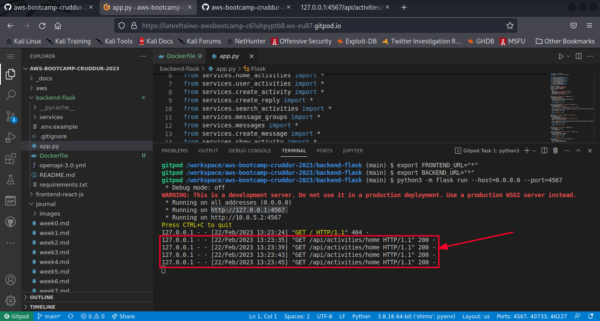
 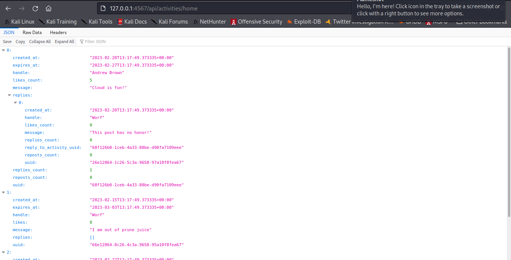
 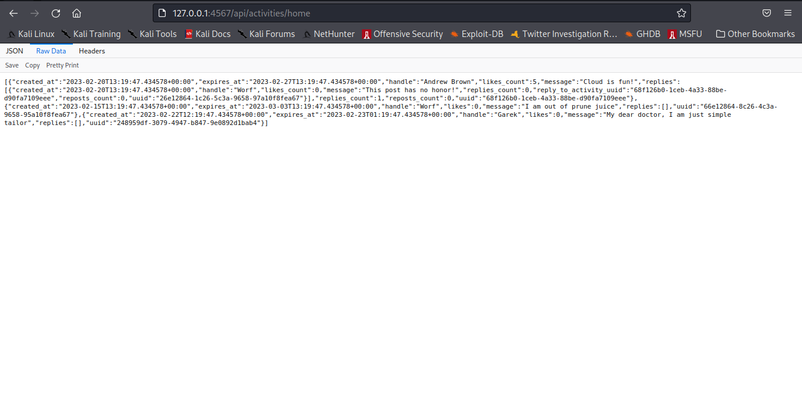

### Add Dockerfile for backend
* Ensure you are in the backend directory

  `cd backend`

  `vim Dockerfile`

 * Paste this code in the Dockerfile. 
    
        FROM python:3.10-slim-buster

        WORKDIR /backend-flask

        COPY requirements.txt requirements.txt
        RUN pip3 install -r requirements.txt

        COPY . .

        ENV FLASK_ENV=development

        EXPOSE ${PORT}
        CMD [ "python3", "-m" , "flask", "run", "--host=0.0.0.0", "--port=4567"]

   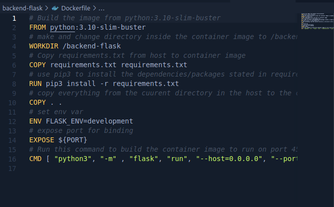

* I type the `docker images` command to see the docker images. This displays the newly built backend-flask image and the base image (python3:3.10-slim-buster). The backend-flask image gets a tag of latest (because we didn't specify a tag)

   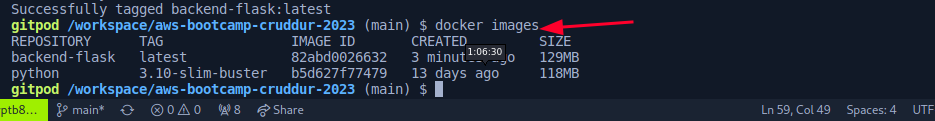

## Build docker image for backend

  `docker build -t  backend-flask ./backend-flask`

  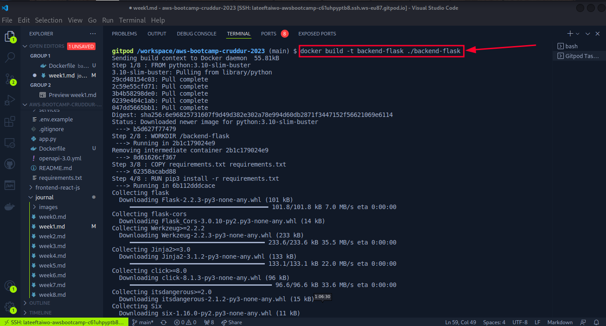

  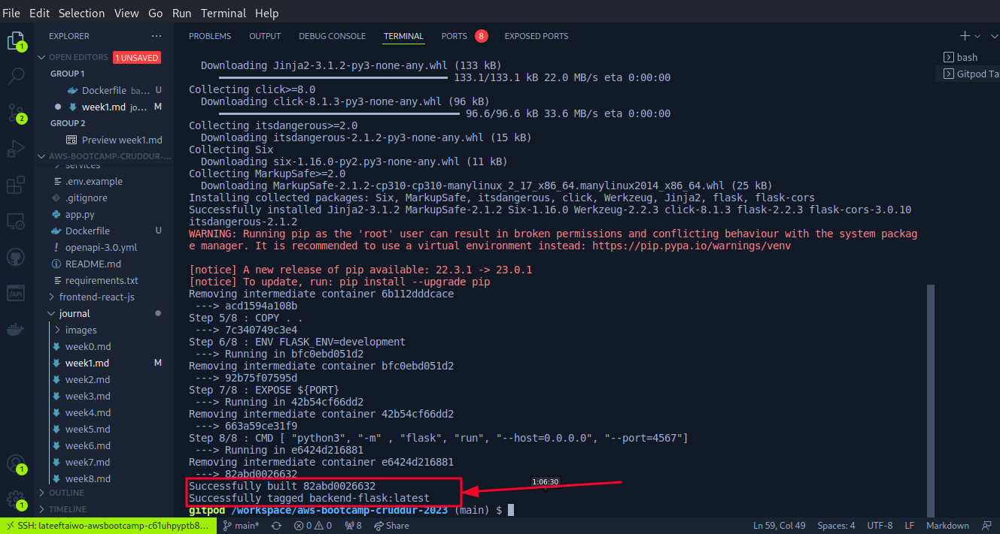
### Run Container using the image built

    docker run --rm -p 4567:4567 -it backend-flask
    FRONTEND_URL="*" BACKEND_URL="*" docker run --rm -p 4567:4567 -it backend-flask
    export FRONTEND_URL="*"
    export BACKEND_URL="*"
    docker run --rm -p 4567:4567 -it -e FRONTEND_URL='*' -e BACKEND_URL='*' backend-flask
    docker run --rm -p 4567:4567 -it  -e FRONTEND_URL -e BACKEND_URL backend-flask
    unset FRONTEND_URL="*"
    unset BACKEND_URL="*"

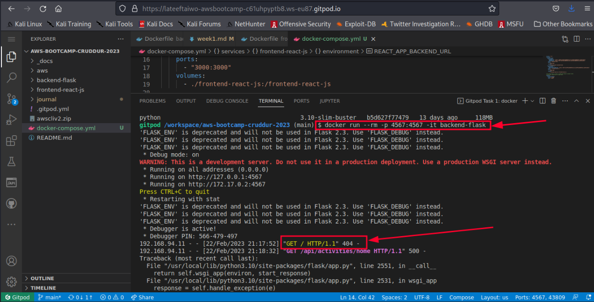

### Run in background

 `docker container run --rm -p 4567:4567 -d backend-flask`

  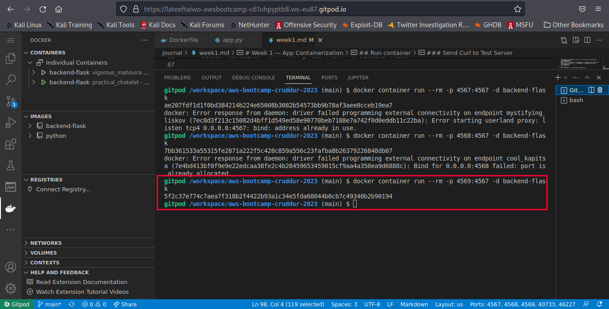

### Return the container id into an Environment variables

 `CONTAINER_ID=$(docker run --rm -p 4567:4567 -d backend-flask)`

### Get Container Images or Running Container Ids

    docker ps
    docker images
  `docker ps` displays containers that are currently running (not exited or stopped), `docker images` displays container images

   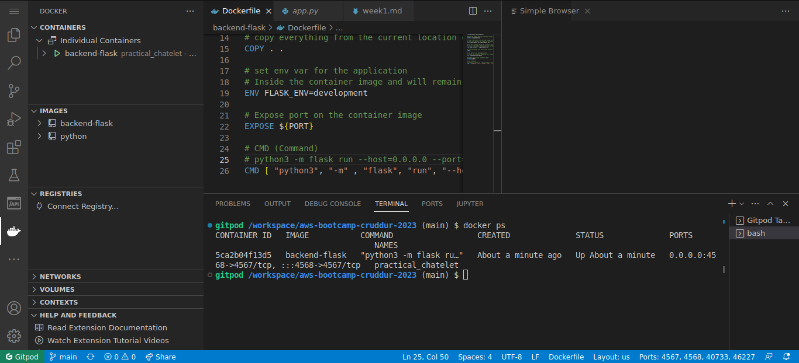
   

### Send Curl to Test Server
    curl -X GET http://localhost:4567/api/activities/home -H "Accept: application/json" -H "Content-Type: application/json"
     
  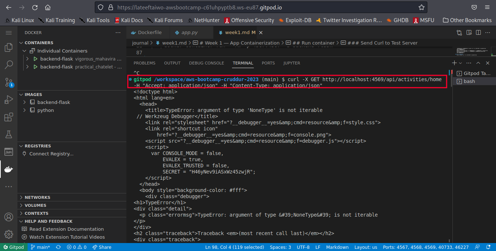

### Check Container Logs
    docker logs CONTAINER_ID -f
    docker logs backend-flask -f
    docker logs $CONTAINER_ID -f

### Debugging adjacent containers with other containers

    docker run --rm -it curlimages/curl "-X GET http://localhost:4567/api/activities/home -H \"Accept: application/json\" -H \"Content-Type: application/json\""

### busybosy is often used for debugging since it install a bunch of thing
     docker run --rm -it busybosy

### Gain Access to a Container

`docker exec CONTAINER_ID -it /bin/bash`
> This can also be written as:

`docker exec CONTAINER_ID -it bash`

> You can just right click a container and see logs in VSCode with Docker extension

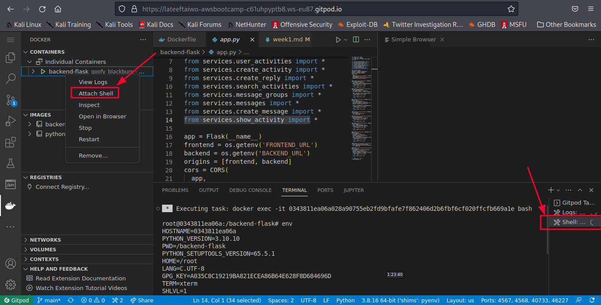

### Delete or Remove a Container Image
    docker image rm backend-flask --force
The `--force` flag removes a container image that is currently running. 
    `docker rmi backend-flask` is the legacy syntax to remove an image

### Overriding Ports

      FLASK_ENV=production PORT=8080 docker run -p 4567:4567 -it backend-flask

## Containerize Frontend
### Run NPM Install
We have to run `npm Install` before building the container since it needs to install some dependencies the contents of node_modules

     cd frontend-react-js
     npm i

### Create Docker File
I Created a Docerfile in the frontend-react-js directory using vim editor.

  `vim Dockerfile`

    FROM node:16.18

    ENV PORT=3000

    COPY . /frontend-react-js
    WORKDIR /frontend-react-js
    RUN npm install
    EXPOSE ${PORT}
    CMD ["npm", "start"]

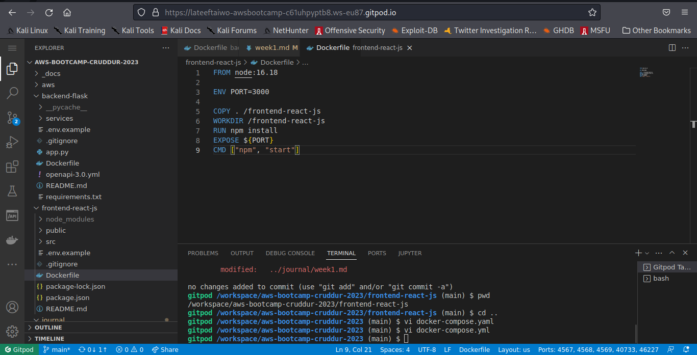

##  Build frontend Container image

    docker build -t frontend-react-js ./frontend-react-js

## Run Container in detached mode
    docker run -p 3000:3000 -d frontend-react-js

## Multiple Containers
### Create a docker-compose file
I Created `docker-compose.yml file` at the root of the project and I pasted the code below in it.

    version: "3.8"
    services:
        backend-flask:
            environment:
            FRONTEND_URL: "https://3000-${GITPOD_WORKSPACE_ID}.${GITPOD_WORKSPACE_CLUSTER_HOST}"
            BACKEND_URL: "https://4567-${GITPOD_WORKSPACE_ID}.${GITPOD_WORKSPACE_CLUSTER_HOST}"
            build: ./backend-flask
            ports:
            - "4567:4567"
            volumes:
            - ./backend-flask:/backend-flask
        frontend-react-js:
            environment:
            REACT_APP_BACKEND_URL: "https://4567-${GITPOD_WORKSPACE_ID}.${GITPOD_WORKSPACE_CLUSTER_HOST}"
            build: ./frontend-react-js
            ports:
            - "3000:3000"
            volumes:
            - ./frontend-react-js:/frontend-react-js

        # the name flag is a hack to change the default prepend folder
        # name when outputting the image names
    networks: 
        internal-network:
            driver: bridge
            name: cruddur

  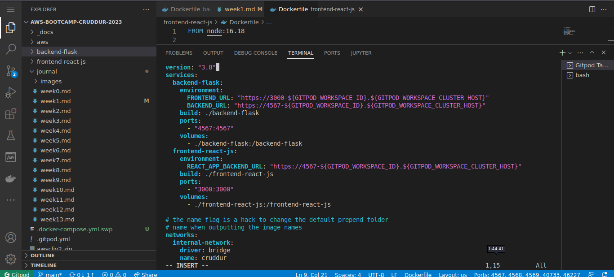

  ### Run frontend and backend containers and make them communicate.

    docker compose -f "docker-compose.yml" up -d --build

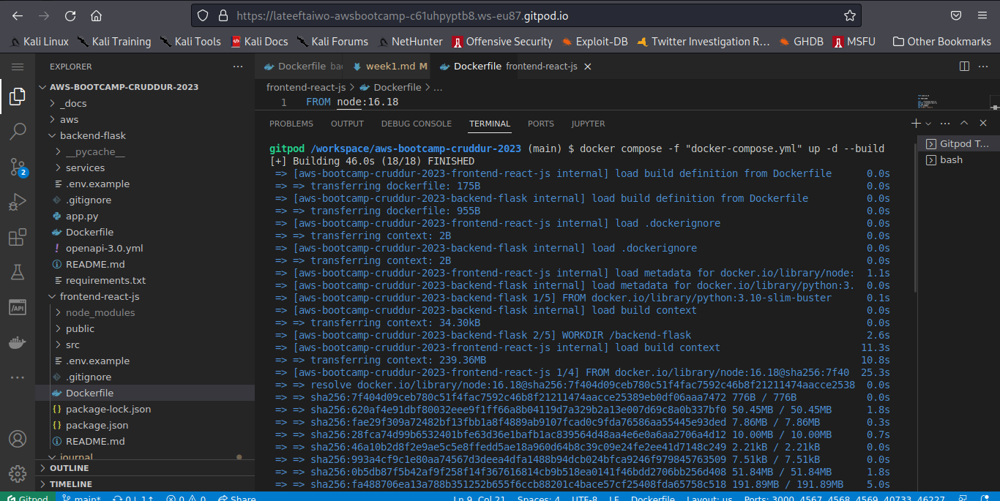

### Open the app
Make sure the padlock on ports 3000 and 4567 are open in the ports session, then open the link with port 300 in the browser.
I encountered the CORS (Cross Origin Resource Sharing) error encountered during the livestream. I checked that the ports are correct in the docker-compose file, and ran the `docker compose -f "docker-compose.yml" up -d --build`. After several hours of building the image and checking online to see if I can get a fix, I discovered that there is an issue with the browser I was using (firefox) its blocks CORS, although I tried to enable it after reading several suggestion fixes on [stackoverflow.com](https://stackoverflow.com/questions/26980713/solve-cross-origin-resource-sharing-with-flask) but the error still persists. Then I opted to use gitpod on Chrome browser and it worked.

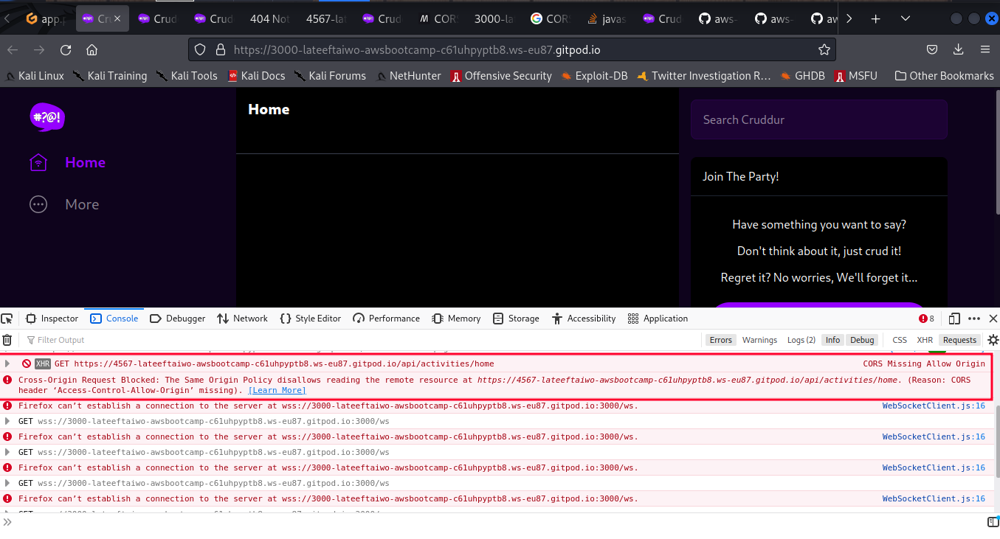

### When I use Chrome

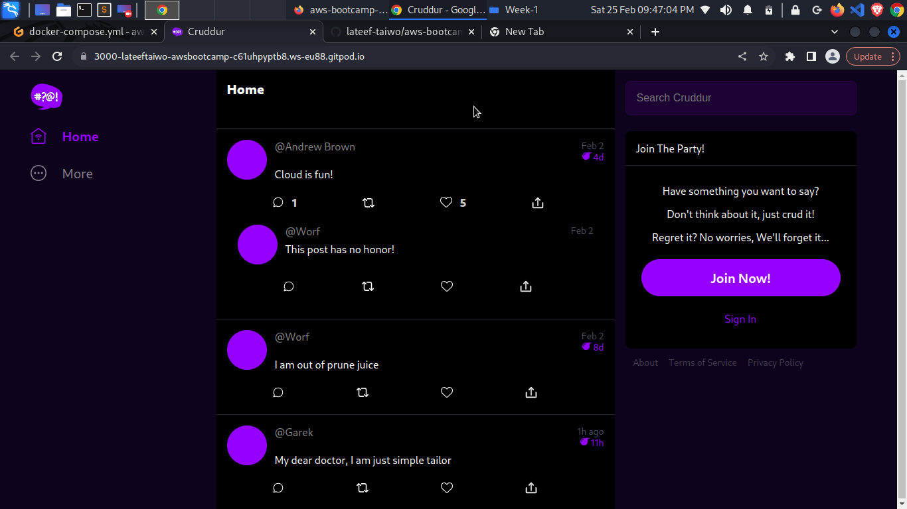

## Adding DynamoDB Local and Postgres
We are going to use Postgres and DynamoDB local in future labs. We can bring them in as containers and reference them externally

Lets integrate the following into our existing docker compose file:

### Postgres
    services:
    db:
        image: postgres:13-alpine
        restart: always
        environment:
        - POSTGRES_USER=postgres
        - POSTGRES_PASSWORD=password
        ports:
        - '5432:5432'
        volumes: 
        - db:/var/lib/postgresql/data
    volumes:
    db:
        driver: local

### To install the postgres client into Gitpod
    - name: postgres
        init: |
        curl -fsSL https://www.postgresql.org/media/keys/ACCC4CF8.asc|sudo gpg --dearmor -o /etc/apt/trusted.gpg.d/postgresql.gpg
        echo "deb http://apt.postgresql.org/pub/repos/apt/ `lsb_release -cs`-pgdg main" |sudo tee  /etc/apt/sources.list.d/pgdg.list
        sudo apt update
        sudo apt install -y postgresql-client-13 libpq-dev

### DynamoDB Local
    services:
        dynamodb-local:
        # https://stackoverflow.com/questions/67533058/persist-local-dynamodb-data-in-volumes-lack-permission-unable-to-open-databa
        # We needed to add user:root to get this working.
        user: root
        command: "-jar DynamoDBLocal.jar -sharedDb -dbPath ./data"
        image: "amazon/dynamodb-local:latest"
        container_name: dynamodb-local
        ports:
        - "8000:8000"
        volumes:
        - "./docker/dynamodb:/home/dynamodblocal/data"
        working_dir: /home/dynamodblocal

### Volumes
Directory volume mapping
    volumes: 
    - "./docker/dynamodb:/home/dynamodblocal/data"

### named volume mapping
    volumes: 
        - db:/var/lib/postgresql/data

    volumes:
        db:
            driver: local

## HOME WORK CHALLENGES
### Run the Dockerfile CMD as an external script
* I created a bash script named `backendflask.sh`. Then I typed the following.
        #!/bin/bash

        python3 -m flask run --host=0.0.0.0     --port=4567

* I made the script executable.
`chmod +x backendflask.sh`

* Then I referenced it inside the CMD line in the Dockerfile.

        # Build the image from python:3.10-slim-buster
        FROM python:3.10-slim-buster
        # make and change directory inside the container image to /backend-flask
        WORKDIR /backend-flask
        # Copy requirements.txt from host to container image
        COPY requirements.txt requirements.txt
        # use pip3 to install the dependencies/packages stated in requirements.txt
        RUN pip3 install -r requirements.txt
        # copy everything from the cuurent directory in the host to the current directory (/backend-flask) in the container image
        COPY . .
        # set env var
        ENV FLASK_ENV=development
        # expose port for binding 
        EXPOSE ${PORT}
        #Run the Dockerfile CMD as an external script
        CMD [ "backendflask.sh" ]
        # Run this command to build the container image to run on port 4567
        #CMD [ "python3", "-m" , "flask", "run", "--host=0.0.0.0", "--port=4567"]

* Next, I built an image from the Dockerfile.
    cd ..
    docker build -t backendflask .

* Finally, I ran a container using the sript.
 docker run -d --name backendflask backendflask

### Push and tag an image to dockerhub

### Use multi-stage building for a Dockerfile build

### Implement a healthcheck in the V3 Docker compose file.

### Research best practices of Dockerfiles and attempt to implement it in your Dockerfile
### Best practices for writing Dockerfiles
Docker builds images automatically by reading the instructions from a Dockerfile.
A Dockerfile follows a specific format and set of instructions which you can find at [Dockerfile reference](https://docs.docker.com/engine/reference/builder/).
A Docker image consists of read-only layers each of which represents a Dockerfile instruction. The layers are stacked and each one is a delta of the changes from the previous layer as seen when building images for both backend and frontend app.

General guidelines and recommendations
1. Understand build context
  The docker build or docker buildx build commands build Docker images from a Dockerfile and a “context”.

  A build’s context is the set of files located at the PATH or URL specified as the positional argument to the build command:
    `docker build [OPTIONS] PATH` as used when building the images. docker build -t backend ./backend-flask/ 
   `./backend-flask` is he PATH specified as the positional argument to the build command.

2. Create ephemeral containers
  The image defined by your Dockerfile should generate containers that are as ephemeral as possible. Ephemeral means that the container can be stopped and destroyed, then rebuilt and replaced with an absolute minimum set up and configuration

3. Exclude with .dockerignore
   To exclude files not relevant to the build, without restructuring your source repository, use a .dockerignore file. This file supports exclusion patterns similar to .gitignore files.

4. Use multi-stage builds
   Multi-stage builds allow you to drastically reduce the size of your final image, without struggling to reduce the number of intermediate layers and files.

  Because an image is built during the final stage of the build process, you can minimize image layers by leveraging build cache.

  For example, if your build contains several layers and you want to ensure the build cache is reusable, you can order them from the less frequently changed to the more frequently changed. The following list is an example of the order of instructions:

  * Install tools you need to build your application

  * Install or update library dependencies

  * Generate your application

5. Don’t install unnecessary packages
   Avoid installing extra or unnecessary packages just because they might be nice to have. For example, you don’t need to include a text editor in a database image.

   When you avoid installing extra or unnecessary packages, you images will have reduced complexity, reduced dependencies, reduced file sizes, and reduced build times.

6. Pipe Dockerfile through stdin
   Docker has the ability to build images by piping a Dockerfile through stdin with a local or remote build context. Piping a Dockerfile through stdin can be useful to perform one-off builds without writing a Dockerfile to disk, or in situations where the Dockerfile is generated, and should not persist afterwards.

7. Build an image using a Dockerfile from stdin, without sending build context
    Use this syntax to build an image using a Dockerfile from stdin, without sending additional files as build context. The hyphen (-) takes the position of the PATH, and instructs Docker to read the build context, which only contains a Dockerfile, from stdin instead of a directory: `docker build [OPTIONS] -`
    The following example builds an image using a Dockerfile that is passed through stdin. No files are sent as build context to the daemon.

            docker build -t myimage:latest -<<EOF
            FROM busybox
            RUN echo "hello world"
            EOF
8. Build from a local build context, using a Dockerfile from stdin
    Use this syntax to build an image using files on your local filesystem, but using a Dockerfile from stdin. The syntax uses the -f (or --file) option to specify the Dockerfile to use, and it uses a hyphen (-) as filename to instruct Docker to read the Dockerfile from stdin:

        docker build [OPTIONS] -f- PATH
    The example below uses the current directory (.) as the build context, and builds an image using a Dockerfile that is passed through stdin using a here document.

            docker build -t myimage:latest -f- . <<EOF
            FROM busybox
            COPY somefile.txt ./
            RUN cat /somefile.txt
            EOF

9. Build from a remote build context, using a Dockerfile from stdin
  Use this syntax to build an image using files from a remote Git repository, using a Dockerfile from stdin. The syntax uses the -f (or --file) option to specify the Dockerfile to use, using a hyphen (-) as filename to instruct Docker to read the Dockerfile from stdin:

        docker build [OPTIONS] -f- PATH
        docker build -t myimage:latest -f- https://github.com/docker-library/hello-world.git <<EOF
        FROM busybox
        COPY hello.c ./
        EOF

10. Minimize the number of layers
    In older versions of Docker, it was important that you minimized the number of layers in your images to ensure they were performant. The following features were added to reduce this limitation:

    Only the instructions RUN, COPY, ADD create layers. Other instructions create temporary intermediate images, and don’t increase the size of the build.

    Where possible, use multi-stage builds, and only copy the artifacts you need into the final image. This allows you to include tools and debug information in your intermediate build stages without increasing the size of the final image.

11. Decouple applications
    Each container should have only one concern. Decoupling applications into multiple containers makes it easier to scale horizontally and reuse containers. For instance, a web application stack might consist of three separate containers, each with its own unique image, to manage the web application, database, and an in-memory cache in a decoupled manner.

    Limiting each container to one process is a good rule of thumb, but it’s not a hard and fast rule. 
    Use your best judgment to keep containers as clean and modular as possible. If containers depend on each other, you can use Docker container networks to ensure that these containers can communicate.

    Multistage build has been implemented in `docker-compose file` as a best practice of Dockerfile

### Learn how to install docker on your local machine and put the same containers running outside gitpod or codespaces.

### Launch an EC2 instance that has docker installed and pull a container to demonstrate that you can run your own docker processes.
* I lanuched an ec2 instance using ubuntu 20.04 t2 micro image and named it docker, I ensured that port 22 is opened to allow remote ssh access. 
* I added one of the keys I used before. The key has neccessary permission already set locally to allow ssh access.

* I opened the terminal on my local machine and logged into the instance:

        ssh -i KEY.PEM ubuntu@PUBLIC-IP-ADDRESS-OF-INSTANCE

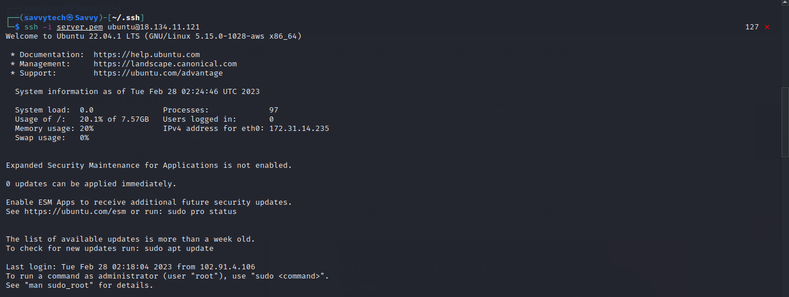

* I checked the docker version on the instance to know if docker is on it

        docker --version

    

* Docker was not on it so I installed it through the following steps.
    * update the instance

            sudo apt udate
    
    * install docker io package which is a package needed for docker to be installed on ubuntu

            sudo apt install docker.io

    
    * Next, I installed docker and checked the version of docker installed

            sudo apt install docker
            docker --version

    

* To demonstrate that I can run my own docker processes, I pulled a httpd container.
        docker pull httpd
    
* It displayed an error and I observed that the error occured because the current user does not have the necessary permissions to run docker commands, thus I opted to use root access which is not a good security practice. I decided to use sudo just to test that I can pull container images.

        sudo docker pull httpd

    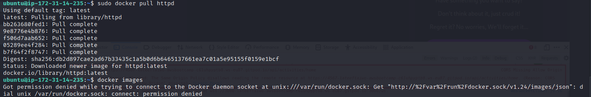

* I checked the image using the `docker images` command, an I got the same error as in the previous step as shown in the image above. Then I decided to change ownership of `/var/run/docker.sock` using the evironment variable `USER`.

       sudo chown -R $USER:$USER /var/run/docker.sock

* The above command grants ownerhip of `/var/run/docker.sock` to the current user and its default group.

   
* Now, I can pull or run docker commands without root privilege.

    docker images

    

